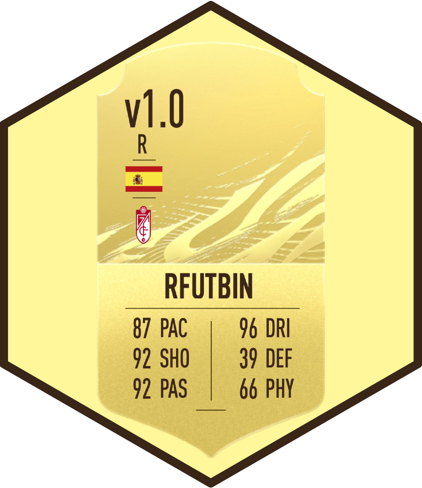

---
output:
  md_document:
    variant: gfm
    toc: true
    toc_depth: 2
---
 


```{r, echo = FALSE}
knitr::opts_chunk$set(
  collapse = TRUE,
  comment = "#>",
  fig.path = "README-"
)
```

```{r, echo = FALSE}
# Remove scientific notation
options(scipen = 999)
```

# rfutbin

R package to get price and stats of FIFA Ultimate Team players in [Futbin](https://www.futbin.com) for all platforms (PS4/XBox One/PC).

## Installation

This package is available only on GitHub. To install it, use the `devtools` package:

```{r eval = FALSE}
library(devtools)
install_github("danielredondo/rfutbin")

library(rfutbin)
```

## Examples

#### Load package

```{r}
library(rfutbin)
```

#### Search for a player

```{r}
futbin_search(name = "Lionel Messi")
```
```{r, echo = FALSE, results='hide'}
Sys.sleep(3)
```

#### The default platform is PS4, but you can get the price in other platforms (XBox One/PC)

```{r}
futbin_search(name = "Lionel Messi", platform = "xone")
futbin_search(name = "Lionel Messi", platform = "pc")
```

```{r, echo = FALSE, results='hide'}
Sys.sleep(3)
```

#### Search for more than one player

```{r}
futbin_search(name = c("Lionel Messi", "Cristiano Ronaldo"))
```
```{r, echo = FALSE, results='hide'}
Sys.sleep(3)
```

#### Search for a specific version of a player

```{r}
# Lewandowski rare card
futbin_search(name = "Lewandowski", version = "Rare")
```
```{r, echo = FALSE, results='hide'}
Sys.sleep(3)
```

```{r}
# Luis Suarez One to watch (OTW)
futbin_search(name = "Luis Suarez", version = "OTW")
```
```{r, echo = FALSE, results='hide'}
Sys.sleep(3)
```

```{r}
# Grealish In-Form (IF) showing verbose
futbin_search(name = "Grealish", version = "IF", verbose = TRUE)
```
```{r, echo = FALSE, results='hide'}
Sys.sleep(3)
```

#### Download all players from a Futbin webpage

```{r}
# All Aston Villa players -> To get the URL, go to futbin.com/players and filter
aston_villa <- futbin_scrap(url = "https://www.futbin.com/players?page=1&club=2")

head(aston_villa)
```
```{r, echo = FALSE, results='hide'}
Sys.sleep(3)
```

```{r}
# All English players in Bundesliga -> To get the URL, go to futbin.com/players and filter
futbin_scrap(url = "https://www.futbin.com/21/players?page=1&league=19&nation=14")
```
```{r, echo = FALSE, results='hide'}
Sys.sleep(3)
```

#### Radar plot comparing Van Dijk and Messi

```{r, eval = FALSE}
players <- futbin_search(name = c("Van Dijk", "Lionel Messi"), version = "Rare")
futbin_plot(players)
```

*(Please note that this is a static version. Real plots are interactive.)*

#### Radar plot comparing goalkeepers:

```{r, eval = FALSE}
some_goalkeepers <- futbin_search(name = c("De Gea", "Kepa", "Hugo Lloris"), version = "Rare")
futbin_plot(some_goalkeepers, gk = TRUE)
```


*(Please note that this is a static version. Real plots are interactive.)*

## Functions

### futbin_search 

`futbin_search` searchs players in Futbin. It has the following parameters:

- `name`. Optional. Vector with the names of the players. If not specified, it will report the 30 highest-rated players of the game.

- `platform`. Platform to get the prices from. Default is `ps4`. Other options are `xone` (XBox One) and `pc`.

- `version`. Optional. Version of the cards. Some options are "Rare", "Non-Rare", "IF" (In-Form), "SIF" (Second In-Form), ...

- `verbose`. Optional. To show additional messages (webpage scraped and number of players found).

The output of the function is a dataframe with all the players found searching for `name` and  `version`.

### futbin_scrap 

`futbin_scrap` extracts all players of a Futbin URL. It has the following parameters:

- `url`. Futbin URL to web scrap. Futbin webpage (https://www.futbin.com/players) can be used to make customised filters, and then copy the URL here. All the players found in the URL (and the next pages) will be automatically detected and downloaded.

- `platform`. Platform to get the prices from. Default is `ps4`. Other options are `xone` (XBox One) and `pc`.

- `sleep_time`. Time (in seconds) ellapsed between scraping one page and the next one. Please respect Futbin API.

- `verbose`. Optional. To show additional verbose about webpage used and number of players found.

The output of the function is a dataframe with all the players found at the URL.

### futbin_plot 

`futbin_plot` makes an interactive radar plot of the stats of the players. It has the following parameters:

- `df` dataframe generated with columns `pac`, `sho`, `pas`, `dri`, `def`, `phy`. This dataframe can be obtained from function `futbin_search`.

- `gk` Optional. If `TRUE`, the labels of the plot are the main stats for goalkeepers: diving, handling, kicking, reflexes, speed and position.

The output of the function is an interactive radar plot of the stats.


## Citation

If you use this package, you can cite it as:


```
Redondo-Sanchez, Daniel (2021). rfutbin (v1.0.2): R package to get price and stats of FIFA Ultimate Team players in Futbin. https://github.com/danielredondo/rfutbin
```
