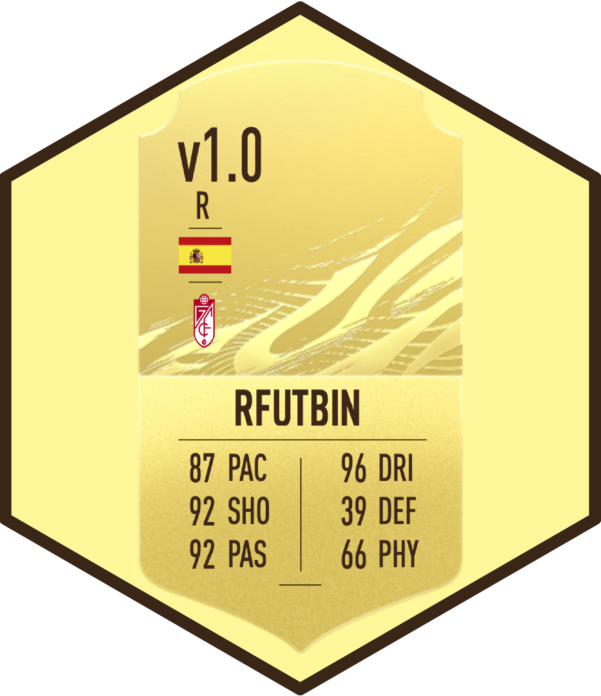

  - [rfutbin](#rfutbin)
      - [Installation](#installation)
      - [Functions](#functions)
      - [Examples](#examples)
      - [Citation](#citation)



# rfutbin

R package to get price and stats of FIFA Ultimate Team players in
[Futbin](https://www.futbin.com).

## Installation

This package is available only on GitHub. To install it, use the
`devtools` package:

``` r
library(devtools)
install_github("danielredondo/rfutbin")

library(rfutbin)
```

## Functions

### futbin\_search

`futbin_search` searchs players in Futbin. It has the following
parameters:

  - `name`. Optional. Vector with the names of the players. If not
    specified, it will report the 30 highest-rated players of the game.

  - `version`. Optional. Version of the cards. Some options are “Rare”,
    “Non-Rare”, “IF” (In-Form), “SIF” (Second In-Form), …

  - `verbose`. Optional. To show additional messages (webpage scraped
    and number of players found).

The output of the function is a dataframe with all the players found
searching for `name` and `version`.

### futbin\_scrap

`futbin_scrap` extracts all players of a Futbin URL. It has the
following parameters:

  - `url`. Futbin URL to web scrap. Futbin webpage
    (<https://www.futbin.com/players>) can be used to make customised
    filters, and then copy the URL here. All the players found in the
    URL (and the next pages) will be automatically detected and
    downloaded.

  - `sleep_time`. Time (in seconds) ellapsed between scraping one page
    and the next one. Please respect Futbin API.

  - `verbose`. Optional. To show additional verbose about webpage used
    and number of players found.

The output of the function is a dataframe with all the players found at
the URL.

### futbin\_plot

`futbin_plot` makes an interactive radar plot of the stats of the
players. It has the following parameters:

  - `df` dataframe generated with columns `pac`, `sho`, `pas`, `dri`,
    `def`, `phy`. This dataframe can be obtained from function
    `futbin_search`.
  - `gk` Optional. If `TRUE`, the labels of the plot are the main stats
    for goalkeepers: diving, handling, kicking, reflexes, speed and
    position.

The output of the function is an interactive radar plot of the stats.

## Examples

#### Load package

``` r
library(rfutbin)
```

#### Search for a player

``` r
futbin_search(name = "Lionel Messi")
#>           name rating position         version   price skills weak_foot pac sho
#> 1 Lionel Messi     98       RW            TOTY 2640000      4         4  93  98
#> 2 Lionel Messi     96       CF LaLiga POTM SBC 1710000      4         4  90  96
#> 3 Lionel Messi     95       CF           TOTGS  710000      4         4  88  95
#> 4 Lionel Messi     94       CF              IF  510000      4         4  86  94
#> 5 Lionel Messi     93       RW            Rare  115000      4         4  85  92
#> 6 Lionel Messi     93       RW              CL  115000      4         4  85  92
#>   pas dri def phy hei popularity base_stats in_game_stats wr_attack wr_defense
#> 1  97  99  43  73 170       5816        503          2449         M          L
#> 2  95  98  41  70 170       4410        490          2384         M          L
#> 3  94  97  40  68 170       2141        482          2348         M          L
#> 4  93  96  39  66 170       4962        474          2315         M          L
#> 5  91  95  38  65 170       7114        466          2273         M          L
#> 6  91  95  38  65 170        813        466          2273         M          L
#>   wei
#> 1  72
#> 2  72
#> 3  72
#> 4  72
#> 5  72
#> 6  72
```

#### Search for more than one player

``` r
futbin_search(name = c("Lionel Messi", "Cristiano Ronaldo"))
#>                 name rating position         version   price skills weak_foot
#> 1       Lionel Messi     98       RW            TOTY 2640000      4         4
#> 2       Lionel Messi     96       CF LaLiga POTM SBC 1710000      4         4
#> 3       Lionel Messi     95       CF           TOTGS  710000      4         4
#> 4       Lionel Messi     94       CF              IF  510000      4         4
#> 5       Lionel Messi     93       RW            Rare  115000      4         4
#> 6       Lionel Messi     93       RW              CL  115000      4         4
#> 7  Cristiano Ronaldo     98       ST            TOTY 6470000      5         4
#> 8  Cristiano Ronaldo     95       ST             TIF 3390000      5         4
#> 9  Cristiano Ronaldo     94       ST             SIF 2450000      5         4
#> 10 Cristiano Ronaldo     93       ST              IF 1400000      5         4
#> 11 Cristiano Ronaldo     92       ST            Rare  335000      5         4
#> 12 Cristiano Ronaldo     92       ST              CL  333000      5         4
#> 13 Cristiano Ronaldo     87       RW   Flashback SBC  334500      5         3
#>    pac sho pas dri def phy hei popularity base_stats in_game_stats wr_attack
#> 1   93  98  97  99  43  73 170       5816        503          2449         M
#> 2   90  96  95  98  41  70 170       4410        490          2384         M
#> 3   88  95  94  97  40  68 170       2141        482          2348         M
#> 4   86  94  93  96  39  66 170       4962        474          2315         M
#> 5   85  92  91  95  38  65 170       7114        466          2273         M
#> 6   85  92  91  95  38  65 170        813        466          2273         M
#> 7   96  98  89  96  44  88 187       7889        511          2465         H
#> 8   92  96  87  93  38  82 187       4326        488          2376         H
#> 9   91  95  85  92  37  80 187       4210        480          2339         H
#> 10  90  94  83  91  36  78 187       5640        472          2301         H
#> 11  89  93  81  89  35  77 187      14868        464          2258         H
#> 12  89  93  81  89  35  77 187       2034        464          2258         H
#> 13  91  79  75  86  30  72 187       2076        433          2091         H
#>    wr_defense wei
#> 1           L  72
#> 2           L  72
#> 3           L  72
#> 4           L  72
#> 5           L  72
#> 6           L  72
#> 7           L  83
#> 8           L  83
#> 9           L  83
#> 10          L  83
#> 11          L  83
#> 12          L  83
#> 13          L  83
```

#### Search for a specific version of a player

``` r
# Lewandowski rare card
futbin_search(name = "Lewandowski", version = "Rare")
#>                 name rating position version price skills weak_foot pac sho pas
#> 6 Robert Lewandowski     91       ST    Rare 59000      4         4  78  91  78
#>   dri def phy hei popularity base_stats in_game_stats wr_attack wr_defense wei
#> 6  86  43  82 184       2058        458          2232         H          M  80
```

``` r
# Luis Suarez One to watch (OTW)
futbin_search(name = "Luis Suarez", version = "OTW")
#>          name rating position version price skills weak_foot pac sho pas dri
#> 2 Luis Suárez     89       ST     OTW 50000      3         4  73  92  86  86
#>   def phy hei popularity base_stats in_game_stats wr_attack wr_defense wei
#> 2  53  85 182        842        475          2326         H          M  86
```

``` r
# Grealish In-Form (IF) showing verbose
futbin_search(name = "Grealish", version = "IF", verbose = TRUE)
#> [1] "Reading... https://www.futbin.com/21/players?page=1&search=grealish"
#> [1] "Player(s) found: 1"
#>            name rating position version price skills weak_foot pac sho pas dri
#> 2 Jack Grealish     83       LM      IF 30500      4         3  80  77  84  87
#>   def phy hei popularity base_stats in_game_stats wr_attack wr_defense wei
#> 2  49  64 180        523        441          2066         M          M  68
```

#### Download all players from a Futbin webpage

``` r
# All Aston Villa players -> To get the URL, go to futbin.com/players and filter
aston_villa <- futbin_scrap(url = "https://www.futbin.com/players?page=1&club=2")
#> [1] "Reading... https://www.futbin.com/players?page=1&club=2"
#> [1] "Player(s) found: 30"
#> [1] "Reading... https://www.futbin.com/players?page=2&club=2"
#> [1] "Player(s) found: 41"
#> [1] "Reading... https://www.futbin.com/players?page=3&club=2"
#> [1] "Player(s) found: 41"

head(aston_villa)
#>                name rating position              version price skills weak_foot
#> 1     Jack Grealish     87      CAM TOTY Honourable Ment     0      4         3
#> 2     Ollie Watkins     84       ST                  SIF 31750      3         4
#> 3 Emiliano Martínez     84       GK                  SIF 44500      1         3
#> 4     Jack Grealish     83       LM                   IF 30500      4         3
#> 5 Emiliano Martínez     82       GK                   IF 35000      1         3
#> 6     Ollie Watkins     81       ST                   IF 19250      3         4
#>   pac sho pas dri def phy hei popularity base_stats in_game_stats wr_attack
#> 1  85  83  89  91  53  69 180       4630        470          2217         M
#> 2  90  84  77  82  54  76 180       3923        463          2188         H
#> 3  85  86  84  86  65  85 195        503        491          1078         M
#> 4  80  77  84  87  49  64 180        523        441          2066         M
#> 5  82  84  82  83  62  82 195        178        475          1072         M
#> 6  88  79  73  78  51  73 180        838        442          2068         H
#>   wr_defense wei
#> 1          M  68
#> 2          H  70
#> 3          M    
#> 4          M  68
#> 5          M    
#> 6          H  70
```

``` r
# All English players in Bundesliga -> To get the URL, go to futbin.com/players and filter
futbin_scrap(url = "https://www.futbin.com/21/players?page=1&league=19&nation=14")
#> [1] "Reading... https://www.futbin.com/21/players?page=1&league=19&nation=14"
#> [1] "Player(s) found: 13"
#> [1] "Reading... https://www.futbin.com/21/players?page=2&league=19&nation=14"
#> [1] "Player(s) found: 13"
#>               name rating position         version  price skills weak_foot pac
#> 1     Jadon Sancho     92       RM         What If 328000      5         3  91
#> 2     Jadon Sancho     89       LM Bundes POTM SBC 134500      5         3  87
#> 3     Jadon Sancho     88       RM  Record Breaker  92000      5         3  87
#> 4     Jadon Sancho     87       RM            Rare  25000      5         3  83
#> 5     Jadon Sancho     87       RM              CL  25500      5         3  83
#> 6   Ryan Sessegnon     87       LM      Objectives      0      4         4  92
#> 7   Ryan Sessegnon     75       LM        non-rare    800      4         3  86
#> 8     Demarai Gray     75       LM        non-rare    850      4         3  87
#> 9  Ademola Lookman     74       RM            Rare  29500      3         4  82
#> 10 Jude Bellingham     69       CM        Non-Rare   1200      3         4  77
#> 11    Reece Oxford     66       CB        Non-Rare    800      2         3  67
#> 12    Clinton Mola     66       LB        Non-Rare    850      2         3  68
#> 13 Keanan Bennetts     63       LM            Rare      0      2         4  75
#>    sho pas dri def phy hei popularity base_stats in_game_stats wr_attack
#> 1   87  86  95  42  74 180       1485        462          2215         H
#> 2   78  83  93  39  67 180      -2427        447          2089         H
#> 3   83  82  91  38  65 180       2229        446          2092         H
#> 4   74  81  91  37  64 180       -308        430          2015         H
#> 5   74  81  91  37  64 180         66        430          2015         H
#> 6   84  84  88  70  75 178        925        493          2325         H
#> 7   67  69  75  65  62 178         56        424          1978         H
#> 8   68  67  80  37  55 180         44        394          1803         M
#> 9   72  66  80  27  60 174         48        387          1828         H
#> 10  65  64  73  55  66 180        689        400          1837         H
#> 11  33  52  56  66  69 191         12        343          1591         M
#> 12  40  63  64  62  63 183          8        360          1670         H
#> 13  59  58  66  41  55 183         10        354          1641         H
#>    wr_defense wei
#> 1           M  76
#> 2           M  76
#> 3           M  76
#> 4           M  76
#> 5           M  76
#> 6           M  71
#> 7           M  71
#> 8           M  74
#> 9           M  71
#> 10          M  72
#> 11          M  78
#> 12          L  78
#> 13          M  73
```

#### Radar plot comparing Van Dijk and Messi

``` r
players <- futbin_search(name = c("Van Dijk", "Lionel Messi"), version = "Rare")
futbin_plot(players)
```


*(Please note that this is a static version. Real plots are
interactive.)*

#### Radar plot comparing goalkeepers:

``` r
some_goalkeepers <- futbin_search(name = c("De Gea", "Kepa", "Hugo Lloris"), version = "Rare")
futbin_plot(some_goalkeepers, gk = TRUE)
```


*(Please note that this is a static version. Real plots are
interactive.)*

## Citation

If you use this package, you can cite it as:

    Redondo-Sanchez, Daniel (2020). rfutbin: R package to get price and stats of FIFA Ultimate Team players in Futbin
